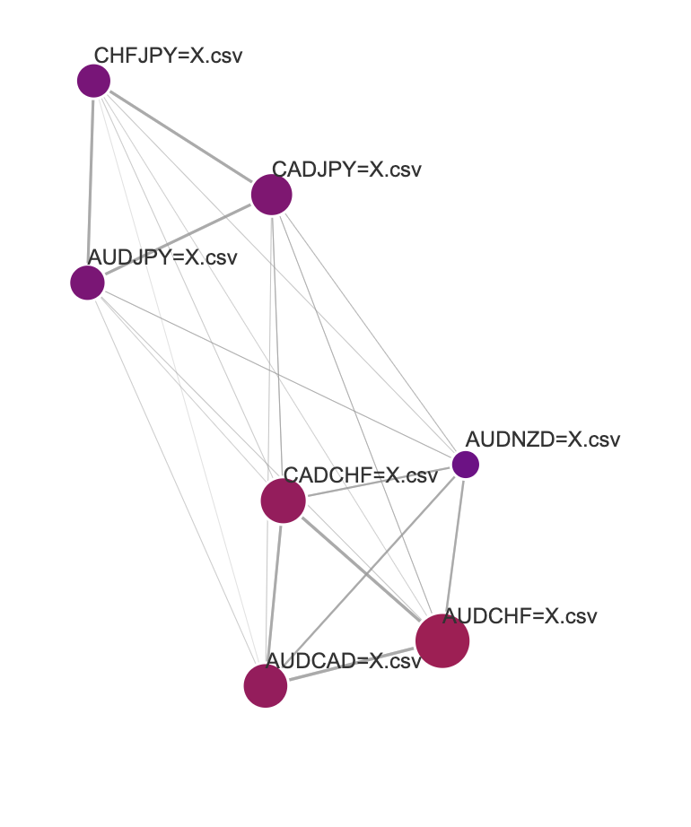

<div align="center">

# **Market Price Movement Prediction**
[](https://discord.gg/bittensor)
[](https://opensource.org/licenses/MIT) 

---

## The Incentivized Internet

[Discord](https://discord.gg/bittensor) • [Network](https://taostats.io/) • [Research](https://bittensor.com/whitepaper)
</div>

---
- [Introduction](#introduction)
  - [Example](#example)
- [Installation](#installation)
  - [Before you proceed](#before-you-proceed)
  - [Install](#install)
- [Writing your own incentive mechanism](#writing-your-own-incentive-mechanism)
- [Writing your own subnet API](#writing-your-own-subnet-api)
- [Subnet Links](#subnet-links)
- [License](#license)

---

## Introduction

This project tries to incentivize miners to make predictions on prices with the connectedness between different market prices. Validators only send out the timestamp to the miners, miners return the prediction of the movement of the target price. Validators score the predictions based on correct movements.

The easiest way for miners would be directly modify the `train_symbols` and `predict_symbol` in `model_config.json` and run `model/train.py` to train the model. Also, there is a visualization tool for miner to check whether the overall connectedness data makes sense.

An example of the visualization:

* The closer, the more connection
* The bigger, the more volatility it gives out to others
* The more red, the more volatility it received from others



## Usage

### Miner

* Setup the model_config, an example:
  ```JSON
  {
    "train_symbols": ["AUDCAD=X", "AUDCHF=X", "AUDJPY=X", "AUDNZD=X", "CADCHF=X", "CADJPY=X", "CHFJPY=X"],
    "predict_symbol": "AUDCAD=X",
    "graph_dir": "model/docs/graph",
    "past_roll_conn_period": 5,
    "max_lag": 20,
    "periods_per_volatility": 20,
    "train_from": 1729206000,
    "train_to": 1729284960,
    "epochs": 10,
    "batch_size": 320,
    "train_dir": "model/docs/train",
    "raw_train_dir": "model/docs/market_prices/train",
    "washed_train_dir": "model/docs/market_prices/washed_train",
    "predict_dir": "model/docs/predict",
    "raw_predict_dir": "model/docs/market_prices/predict",
    "washed_predict_dir": "model/docs/market_prices/washed_predict",
  }
  ```
  * `train_symbols`: the symbols to calculate rolling connectedness by minute. As current mechanism calculates rolling by minute, it naturally requires overlaps of these market timezones.
  * `past_roll_conn_period`: how many past period of connectedness for you to make one period of training or prediction.
  * `max_lag`: the max lag to do the statistics estimation. Should you meet math domain issue, try to increase the number of lag to let it have enough data to do estimation.
  * `periods_per_volatility`: how many past periods of volatility to estimate a connectedness
  * `train_from` & `train_to`: the periods of timeseries data that you want to train the model
  * Other directory variables are the structure to store the required scraped washed data
* Run
  ```python
  # scrape data
  python model/scrape_train_data.py
  # train model
  python model/train.py
  ```
* Visualization
  ```python
  # Get the full connectedness
  python model/graph_script.py
  # start a simple server
  python3 -m http.server

  # Then visit http://localhost:8000/graph.html in browser
  ```
* Start your miner based on the `running_on_staging.md`, `running_on_testnet.md`, `running_on_mainnet.md`

### Validator

* Start your validation based on the `running_on_staging.md`, `running_on_testnet.md`, `running_on_mainnet.md`
